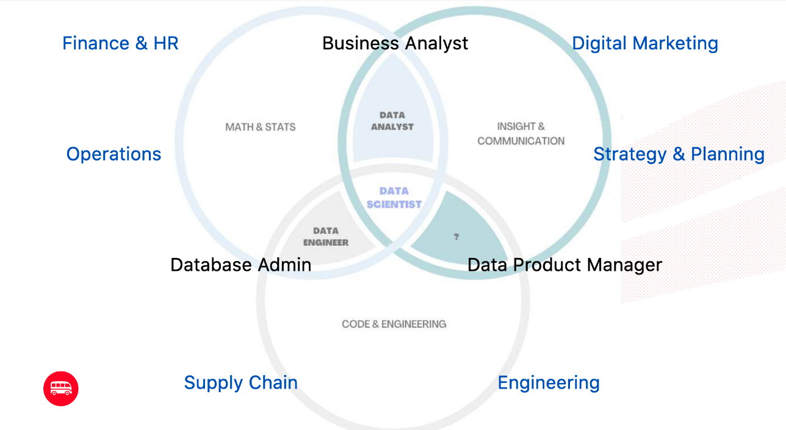

# 📘 Machine Learning Journey with Scikit-learn

## 🤖 Why We Need Machine Learning
Programming uses *experience* to recognize complex patterns and create formulas for prediction.

Machine Learning, however, uses *data* to recognize those patterns and build models that predict outcomes — more scalable, flexible, and powerful.

> "Good CS expert says: Most firms that think they want advanced AI/ML really just need linear regression on cleaned-up data."
> — *Robin Hanson, Professor at George Mason University*

We need Machine Learning for:
- 🧠 **Computer Vision**
- 🎯 **Recommendation Engines**
- 🗣 **Natural Language Processing (NLP)**
- 📈 **Time Series Forecasting**
- ⚠️ **Anomaly Detection**

---

## 📊 Reliable Data Sources
- [Statista](https://www.statista.com/) — trusted industry statistics
- [Kaggle](https://www.kaggle.com/) — community and competition-based datasets

> The dataset used in this project is [`education_career_success.csv`](education_career_success.csv).

---

## 🚣️ Career Path Overview


---

## 🛠️ Scikit-learn Capabilities
Visit [Scikit-learn Documentation](https://scikit-learn.org/stable/) to explore what you can build with it.

- For example: [Ordinary Least Squares Regression](https://setosa.io/ev/ordinary-least-squares-regression/) explains the intercept and coefficient visually.
- [ML Playground](https://ml-playground.com/) is a great way to grasp models like **K-Nearest Neighbors (KNN)** — used for both regression and classification.

---

## 💡 Feature Importance
**Feature permutation importance** evaluates how each feature contributes to the model's performance.

---

## 🧱 Machine Learning Model Steps with Sklearn

1. **Select your feature(s) and target variable**
2. **Import the model from Sklearn**
```python
from sklearn.MODULE_NAME import MODEL_NAME
my_model = MODEL_NAME()
```

3. **Split your data into features (X) and target (y)**
```python
X = dataset.drop("target_column", axis='columns')
y = dataset["target_column"]
```

4. **Split into training and test sets**
```python
from sklearn.model_selection import train_test_split
X_train, X_test, y_train, y_test = train_test_split(X, y, test_size=0.3)
```

5. **Train the model**
```python
my_model.fit(X_train, y_train)
```

6. **Score the model**
```python
my_model.score(X_test, y_test)
```

7. **Make predictions**
```python
new_data = [[FEATURE_1, FEATURE_2, ...]]
my_model.predict(new_data)
```

8. **Explain the model using feature permutation**
```python
from sklearn.inspection import permutation_importance
permutation_score = permutation_importance(my_model, X_train, y_train, n_repeats=50)
```

---

## 🌟 Highlights
- First experience with **Regression** and **Classification** using `scikit-learn`
- Learned how to evaluate models, make predictions, and interpret results

---

## 🎓 Enrolled in Le Wagon Data Science Bootcamp

**Covered topics:**
1. Python Web Scraping Sprint
2. Data Analytics with Python Sprint
3. Data Science Fundamentals
    - Python
    - Mathematics: Statistics, Linear Algebra, Calculus
4. Machine Learning Sprint
5. JavaScript Sprint 2023
6. Web Development Sprint

---

> 🚀 Excited to continue this journey into Machine Learning and explore more real-world applications!

